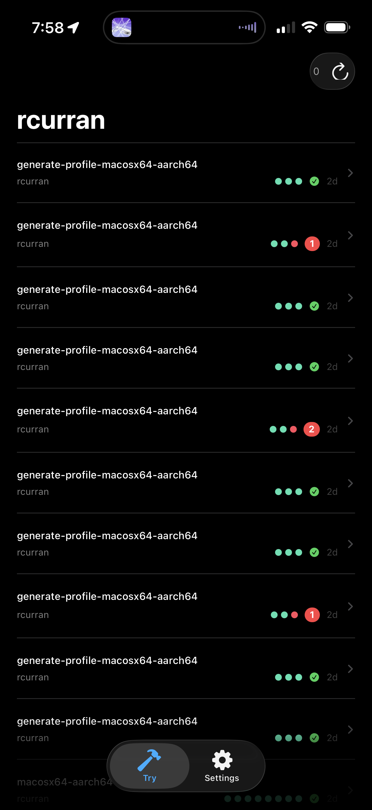
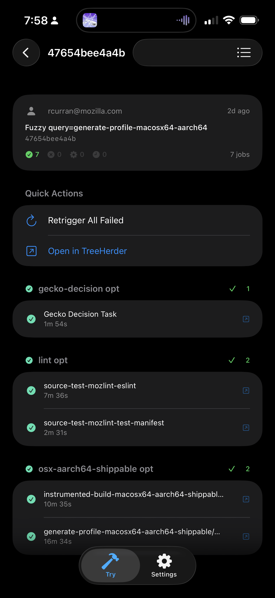
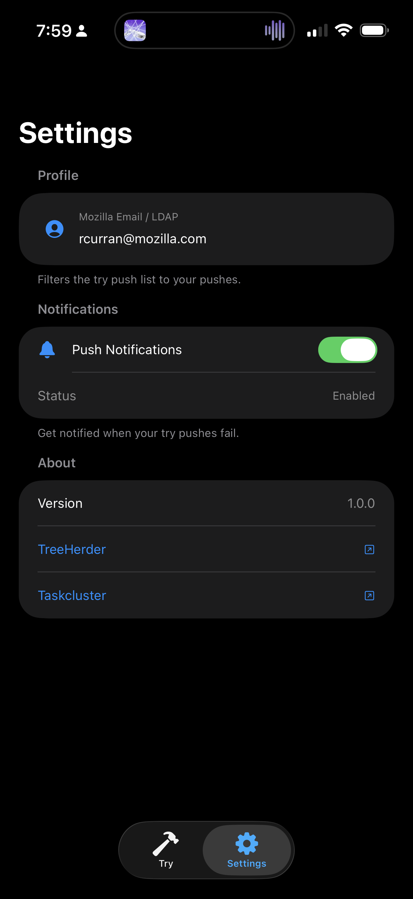

# BuildWatch

A native iOS app for Mozilla engineers to monitor Firefox CI build status from their phone. Built for sheriffs, on-call engineers, and developers who want real-time build feedback without opening a laptop.


<p align="center">
  
  
  
</p>
<p align="center"><em>Try Pushes &nbsp;·&nbsp; Push Detail &nbsp;·&nbsp; Settings</em></p>

---

## Features

### Dashboard
- Live push list across mozilla-central, autoland, beta, release, and esr128
- Per-push platform status dots — color coded by worst result (green / red / orange / blue)
- Failure count badge and animated spinner for in-progress builds
- Tree status banner when the tree is closed or restricted
- Pull-to-refresh with last-updated timestamp
- Quick project switcher in the nav bar

### Push Detail
- Full commit messages with clickable bug number links
- Jobs grouped by platform (linux64, win64, macos, android-arm64, …)
- Filter by All / Failures / Running
- Swipe left on any job to retrigger it
- **Retrigger All Failed** with a single tap
- Links to TreeHerder and Taskcluster for each push
- Duration shown for every completed job

### My Pushes
- Filtered view of your own pushes via the TreeHerder `?author=` API
- Set your Mozilla email once in Settings

### Settings
- LDAP / Mozilla email for the My Pushes tab
- Bugzilla API key for filing bugs directly from a failure
- Push notification opt-in (build failures, tree closures)
- Default repository preference
- Tier 2 job visibility toggle

---

## Data Sources

| Source | Used For |
|--------|----------|
| [TreeHerder](https://treeherder.mozilla.org) | Push list, job results, retrigger actions |
| [TreeStatus](https://treestatus.prod.lando.prod.cloudops.mozgcp.net) | Tree open / closed / restricted status |
| [Taskcluster](https://firefox-ci-tc.services.mozilla.com) | Task deep links |
| [Bugzilla](https://bugzilla.mozilla.org) | Bug links from commit messages, filing new bugs |

---

## Architecture

```
BuildWatch/
├── Models/
│   ├── Push.swift          — Push + PushRevision
│   ├── Job.swift           — Job, JobResult, JobState, PlatformGroup
│   └── TreeStatus.swift    — Tree open/closed state
├── Services/
│   ├── TreeHerderService.swift   — All TreeHerder + TreeStatus API calls
│   └── BugzillaService.swift     — Bug filing
├── ViewModels/
│   └── DashboardViewModel.swift  — @Observable state, drives all three tabs
└── Views/
    ├── DashboardView.swift     — Push list
    ├── PushDetailView.swift    — Jobs, quick actions
    ├── MyPushesView.swift      — Filtered to your pushes
    └── SettingsView.swift      — Preferences
```

State is managed with Swift's `@Observable` macro. All networking uses `async/await` with `URLSession`. The TreeHerder jobs response uses a compact `[[Any]]` format that's parsed with `JSONSerialization` and an index map built from the `job_property_names` field.

---

## Requirements

- Xcode 26+
- iOS 26+ device or simulator
- Mozilla network access (or VPN) is not required — all APIs are public

---

## Building

1. Clone the repo
2. Open `BuildWatch.xcodeproj`
3. Select your team in Signing & Capabilities
4. Run on device or simulator

No external dependencies. No package manager.

---

## Optional Setup

**My Pushes tab** — add your `@mozilla.com` email in Settings → Profile.

**Bug filing** — generate a Bugzilla API key at [bugzilla.mozilla.org → Preferences → API Keys](https://bugzilla.mozilla.org/userprefs.cgi?tab=apikey) and paste it in Settings → Bugzilla Integration.

**Retrigger / Acknowledge** — these actions call authenticated TreeHerder endpoints. Full support requires a Taskcluster OIDC session (coming soon).

---

## Roadmap

- [ ] Push notifications for build failures via FCM
- [ ] Acknowledge / classify failures
- [ ] Backout via Lando API
- [ ] File bug pre-filled with failure details
- [ ] WebSocket live updates from TreeHerder
- [ ] Intermittent failure history
- [ ] Sheriff mode — tree management quick actions
- [ ] Apple Watch complication for tree status

---

## Contributing

PRs welcome. File issues at [bugzilla.mozilla.org](https://bugzilla.mozilla.org) under `Firefox :: Developer Tools`.

---

*Built by [@rcurranmoz](https://github.com/rcurranmoz) · Powered by [TreeHerder](https://treeherder.mozilla.org)*
