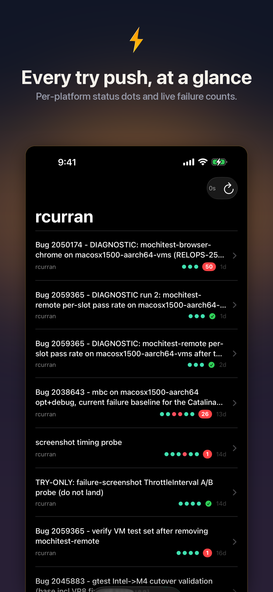
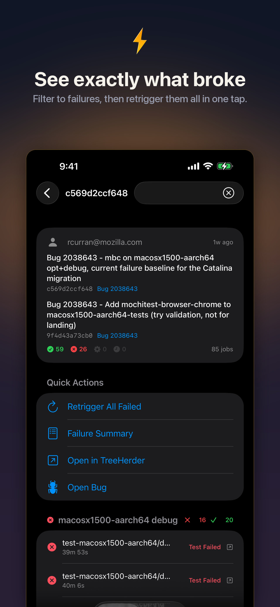
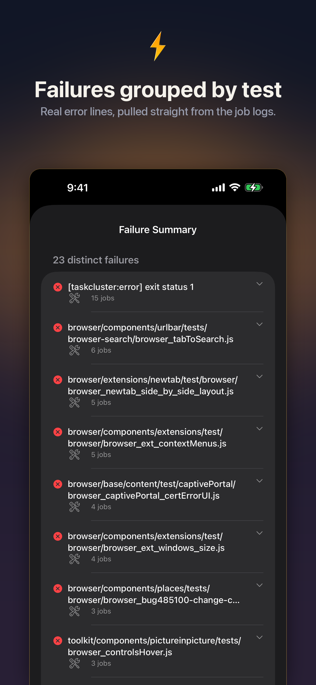
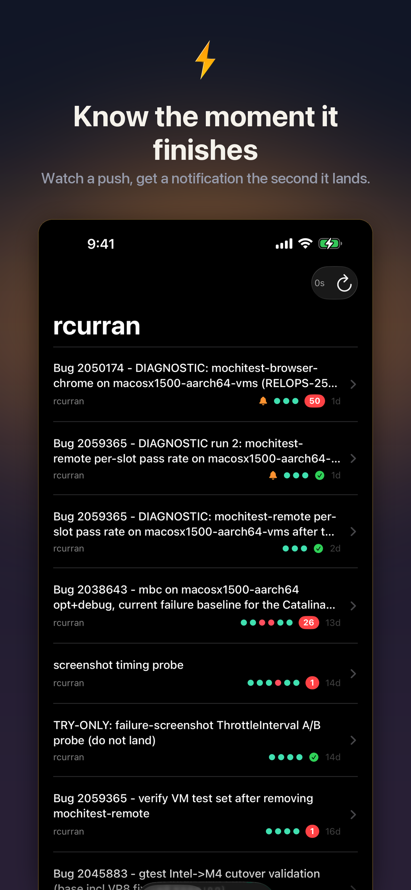

<p align="center">
  
</p>

<h1 align="center">BuildWatch</h1>

<p align="center">
  <strong>Your Firefox try pushes, on your phone.</strong><br/>
  Push to try, close the laptop, get on with your day.
</p>

<p align="center">
  <a href="https://apps.apple.com/us/app/buildwatch-moz/id6759932755">
    
  </a>
  
  
  
  
  
</p>

<p align="center">
  <a href="https://apps.apple.com/us/app/buildwatch-moz/id6759932755"><strong>Download BuildWatch Moz on the App Store →</strong></a>
</p>

---

BuildWatch shows you every try push you've made, what's still running, what went red, and
exactly which tests failed — without opening TreeHerder in a browser. Built for the Mozilla
engineers who push to try a dozen times a day and don't want to babysit a tab.

**Live on the App Store since 24 August 2026.** Free, no account, no tracking, ~1.2 MB.
Every API it talks to is public, so it works off the corporate network with no VPN.

<p align="center">
  
  
  
  
</p>

---

## What it does

### The push list

Your try pushes, newest first, filtered to you via TreeHerder's `?author=` API. Each row
carries a row of per-platform status dots coloured by that platform's worst result, a red
badge with the tier-1 failure count, a spinner while anything is still building, and how
long ago you pushed.

Swipe a row to **watch** it. When the last job resolves you get a local notification with
the pass/fail count — sent time-sensitive if anything went red, so it cuts through a Focus
mode. The watch is one-shot: it clears itself once it fires.

### Push detail

Tap through for the full commit messages, a counts bar (passed / failed / running /
pending), and every job grouped by platform and build option. Filter to **All**,
**Failures**, or **Running**.

Tier-2 jobs are counted separately rather than folded in, because the platform groups below
only list tier 1 — so the headline number always matches the dots next to it.

Bug numbers in commit messages become tappable links. Every job row deep-links to its
Taskcluster task. All external links (TreeHerder, Taskcluster, Bugzilla) open in an in-app
Safari sheet — one tap to dismiss, no app switch.

### Failure Summary

The reason the app exists. It pulls TreeHerder's structured `text_log_errors` for up to 15
failed jobs concurrently, groups them by test path, and ranks by how many jobs each one hit.
Expand a row for the raw error line.

A wall of red jobs collapses into "this one test broke across fifteen of them" — which is
the question you actually had.

### Settings

Your LDAP handle (just the handle — `rcurran`, not the full address) and a notification
opt-in that shows its live authorization status.

---

## Data sources

| Source | Used for |
|--------|----------|
| [TreeHerder](https://treeherder.mozilla.org) | Push list, job results, text log errors |
| [Taskcluster](https://firefox-ci-tc.services.mozilla.com) | Task deep links |
| [Bugzilla](https://bugzilla.mozilla.org) | Bug links parsed out of commit messages |

All read-only, all public, all unauthenticated. BuildWatch stores nothing but your LDAP
handle and your watch list, both in `UserDefaults` on-device.

---

## Architecture

```
BuildWatch/
├── BuildWatchApp.swift        — app entry, notification delegate + deep link
├── ContentView.swift          — two-tab shell (Try / Settings)
├── Extensions.swift           — relative-time helpers, SFSafariViewController wrapper
├── Models/
│   ├── Push.swift             — Push, PushRevision, try-message cleanup
│   ├── Job.swift              — Job, JobResult, JobState, PlatformGroup
│   └── FailureLine.swift      — TextLogError, FailureGroup
├── Services/
│   └── TreeHerderService.swift    — TreeHerder API, compact-job parser
├── ViewModels/
│   └── DashboardViewModel.swift   — @Observable state for both tabs
└── Views/
    ├── DashboardView.swift        — push list (TryPushesView)
    ├── PushDetailView.swift       — jobs, quick actions, counts bar
    ├── FailureSummaryView.swift   — grouped failure sheet
    └── SettingsView.swift         — preferences
```

SwiftUI throughout, state via the `@Observable` macro, networking via `async/await` on
`URLSession`. **No external dependencies and no package manager** — clone, open, run.

**The compact job format.** TreeHerder's `/jobs/?return_type=list` endpoint doesn't return
objects. It returns a `job_property_names` array and then every job as a bare positional
`[Any]` row — 37 columns, of which BuildWatch reads 14. `Codable` can't express that, so the
parser builds a column map from the header once per response and indexes `JSONSerialization`
output directly.

A busy try push is ~750 jobs and 400 KB; a big one runs past 1,200 jobs and 676 KB. That
size is the constraint every design decision below is working against.

---

## Requirements

- Xcode 26+
- iOS 26.2+ (iPhone or iPad — the App Store build is universal)
- No Mozilla network access or VPN required

## Building

```bash
git clone https://github.com/mozilla-platform-ops/BuildWatch.git
cd BuildWatch
open BuildWatch.xcodeproj
```

Set your team under Signing & Capabilities, then run. That's the whole setup.

On first launch, put your LDAP handle in **Settings → Profile** — the push list is empty
until it knows who you are.

---

## Not implemented, on purpose

**Retrigger, acknowledge, and classify.** These are the obvious next features and they are
all blocked on the same thing: TreeHerder gates every write behind a Taskcluster OIDC
session, which BuildWatch does not implement.

Version 1.0 ships a **Retrigger All Failed** button that posts unauthenticated and is
rejected server-side, failing quietly. It should not have shipped in that state; it is
removed on the branch described below, and no write action will return until sign-in lands
behind it.

---

## Unreleased — performance and accessibility pass

Branch [`perf-and-accessibility-pass`](https://github.com/mozilla-platform-ops/BuildWatch/tree/perf-and-accessibility-pass).
Complete and unmerged, **not** in the 1.0 App Store build.

### Incremental refresh

1.0 re-downloads every job on every read. The branch keeps TreeHerder's own `last_modified`
high-water mark per push and passes it back as `last_modified__gt`, so a poll carries only
the rows whose state actually moved — roughly **142 KB down to 1.7 KB** on a 1,262-job push.

Two subtleties, both load-bearing:

- TreeHerder parses that filter at **second** granularity, making it inclusive of the
  watermark's own second. The client rewinds the mark two seconds anyway, so a row written
  in the same second as the previous read cannot fall through the gap. Re-sending a handful
  of rows is far cheaper than showing a stale result.
- The watermark is always the server's string, never a device clock reading, so a phone with
  skewed time can't silently skip updates.

### Off the main thread

The project builds with `SWIFT_DEFAULT_ACTOR_ISOLATION = MainActor`. That default quietly
pinned every request *and* every JSON parse to the main actor — including deserialising a
676 KB payload with the user's finger still on the screen. Marking `TreeHerderService`
`nonisolated` moves the wait and the parse off; only the finished `Sendable` result crosses
back.

### Precomputed derived state

Platform grouping and pass/fail/running counts used to be computed properties evaluated
inside `body`. Rendering one push row ran three full passes over that push's job array, and
because `jobsByPush` is `@Observable`, one push's jobs arriving invalidated every visible
row. `PushSummary` computes all of it once at ingest; the view does an O(1) lookup.

### Legible in light mode

Three of the four original status colours failed WCAG AA non-text contrast (3:1) on a white
list row — success green sat at **1.67:1**, effectively invisible. `StatusPalette` is now a
light/dark pair per colour: darkened light variants at 4.4:1–5.7:1 on white, the original
bright variants unchanged in dark mode.

### Accessibility

Full VoiceOver support — each push row speaks as one sentence carrying its title, author,
age, and the status the dots encode (previously the dots announced as nothing at all).
Status dots switch to distinct silhouettes (✓ ✗ ⋯ −) under *Differentiate Without Color* and
scale with Dynamic Type. Loading shimmer respects *Reduce Motion*.

### Also on the branch

- **Adaptive background polling** — 30s while anything is building, 120s once settled,
  paused when the app isn't frontmost. The automatic tick only re-reads the head of the list
  plus anything watched; a manual pull re-reads everything on screen. 1.0 polls not at all,
  and its pull-to-refresh only refreshed *watched* pushes, so unwatched status dots stayed
  frozen at whatever they were on first load.
- **Live elapsed time** on running jobs — 1.0 showed nothing, so a job 20 seconds in and a
  job wedged for 40 minutes looked identical.
- **Haptics** — distinct feedback for refresh, watch, pass, and fail.
- **Retrigger removed** rather than left failing silently.

### Correctness fixes on top

**Tier-2 jobs now count toward completion.** `PushSummary` gates its counting loop on
`tier == 1`, so tier-2 jobs still running were invisible to `isComplete` — while the
completion notification's failure count *did* include tier-2 failures. A push could be
declared finished with tier-2 work still going, firing "Try push passed" early, and because
the watch is one-shot no correction followed.

Measured by reconstructing job end timestamps across 17 fully-completed real try pushes:
**2 of them (12%)** had a window where every tier-1 job was done and tier-2 was not — 6.3
and 14.3 minutes wide. Tier 2 is not a rounding error either; all 30 pushes sampled carried
tier-2 jobs, and one was 209 tier-1 against 545 tier-2. The dots and platform groups stay
tier-1-only, which was always the intent — only completion changes.

**The About screen reads the bundle.** It previously showed a hardcoded `1.0.0` whatever was
installed, which made a TestFlight build indistinguishable from the App Store one.

**Failure Summary admits when it's sampling.** It pulls logs for the first 15 failed jobs —
one request each, a deliberate ceiling on a burst against a shared public service — but
rendered the result as though it were complete. Per-group counts are bounded by that sample,
so a test that really hit 40 jobs read as "15 jobs". The sheet now says so when the sample is
partial.

### Benchmarks

`Benchmarks/ParserBenchmark.swift` is a standalone executable that runs the old and new
parsers against a real TreeHerder payload and asserts they produce identical rows:

```bash
Benchmarks/fetch-fixture.sh /tmp/push.json
swiftc -O Benchmarks/ParserBenchmark.swift -o /tmp/bwbench
/tmp/bwbench /tmp/push.json
```

---

## Roadmap

- [x] Local notifications when a watched push finishes
- [x] Failure Summary grouped by test
- [x] Ship 1.0 to the App Store
- [ ] Merge the performance and accessibility pass
- [ ] Taskcluster OIDC sign-in — the prerequisite for every write action below
- [ ] Retrigger jobs (needs sign-in)
- [ ] Acknowledge / classify failures (needs sign-in)
- [ ] Backout via Lando API
- [ ] File a bug pre-filled with failure details
- [ ] WebSocket live updates from TreeHerder
- [ ] Intermittent failure history
- [ ] Sheriff mode — tree management quick actions
- [ ] Apple Watch complication for tree status

---

## Contributing

PRs welcome. File issues at [bugzilla.mozilla.org](https://bugzilla.mozilla.org) under
`Firefox :: Developer Tools`.

---

<p align="center">
  <a href="https://apps.apple.com/us/app/buildwatch-moz/id6759932755">BuildWatch Moz on the App Store</a>
  &nbsp;·&nbsp;
  Built by <a href="https://github.com/rcurranmoz">@rcurranmoz</a>
  &nbsp;·&nbsp;
  <a href="https://github.com/mozilla-platform-ops/BuildWatch">mozilla-platform-ops/BuildWatch</a>
  &nbsp;·&nbsp;
  Powered by <a href="https://treeherder.mozilla.org">TreeHerder</a>
</p>
