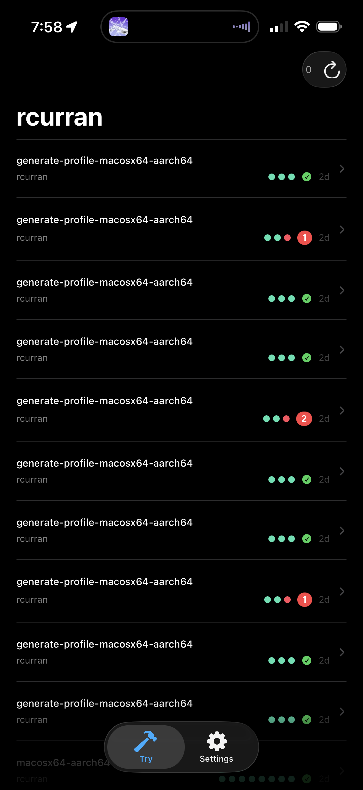
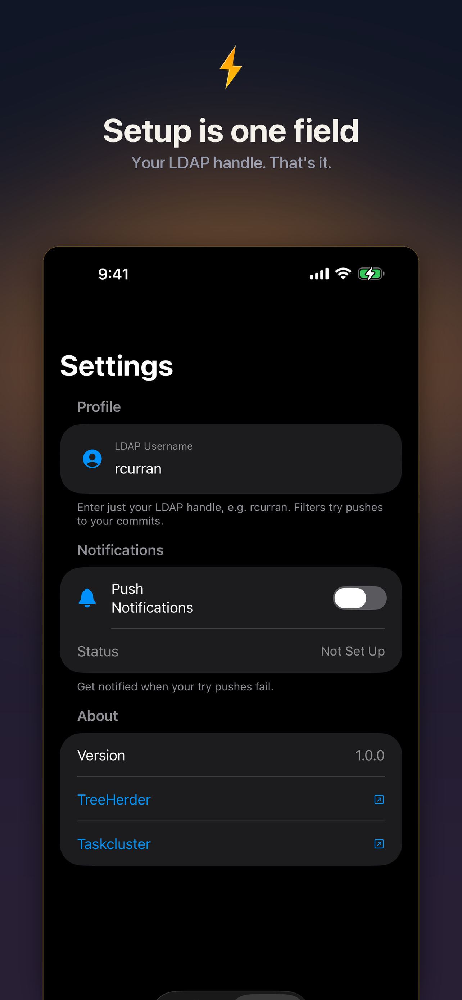

# BuildWatch

A native iOS app for Mozilla engineers to monitor Firefox CI build status from their phone. Built for sheriffs, on-call engineers, and developers who want real-time build feedback without opening a laptop.


<p align="center">
  
  
  
</p>
<p align="center"><em>Try Pushes &nbsp;·&nbsp; Push Detail &nbsp;·&nbsp; Settings</em></p>

---

## Features

### Dashboard
- Live push list across mozilla-central, autoland, beta, release, and esr128
- Per-push platform status dots — color coded by worst result (green / red / orange / blue)
- Failure count badge and animated spinner for in-progress builds
- Tree status banner when the tree is closed or restricted
- Pull-to-refresh with last-updated timestamp, plus background polling every 30s while
  anything is still building (120s once everything has settled)
- Incremental job refresh — a poll transfers only the jobs whose state changed
- Haptic feedback on refresh, watch, retrigger, and push completion
- Full VoiceOver support; status dots switch to distinct shapes under
  *Differentiate Without Color* and scale with Dynamic Type

### Push Detail
- Full commit messages with clickable bug number links
- Jobs grouped by platform (linux64, win64, macos, android-arm64, …)
- Filter by All / Failures / Running
- Swipe left on any job to retrigger it
- **Retrigger All Failed** with a single tap
- **Failure Summary** — groups failed jobs by test name, shows affected job counts and raw error lines from TreeHerder log data
- All external links (TreeHerder, Taskcluster, Bugzilla) open in an in-app browser — tap Done to return instantly without leaving the app
- Duration shown for every completed job, and a live ticking elapsed time for running ones
- **Retrigger All Failed** issues its requests concurrently and reports how many landed

### My Pushes
- Filtered view of your own pushes via the TreeHerder `?author=` API
- Set your Mozilla email once in Settings

### Settings
- LDAP / Mozilla email for the My Pushes tab
- Bugzilla API key for filing bugs directly from a failure
- Push notification opt-in (build failures, tree closures)
- Default repository preference
- Tier 2 job visibility toggle

---

## Data Sources

| Source | Used For |
|--------|----------|
| [TreeHerder](https://treeherder.mozilla.org) | Push list, job results, retrigger actions, text log errors |
| [TreeStatus](https://treestatus.prod.lando.prod.cloudops.mozgcp.net) | Tree open / closed / restricted status |
| [Taskcluster](https://firefox-ci-tc.services.mozilla.com) | Task deep links |
| [Bugzilla](https://bugzilla.mozilla.org) | Bug links from commit messages, filing new bugs |

---

## Architecture

```
BuildWatch/
├── Models/
│   ├── Push.swift            — Push + PushRevision
│   ├── Job.swift             — Job, JobResult, JobState, PlatformGroup
│   ├── PushSummary.swift     — Derived per-push job state, computed once at ingest
│   ├── StatusPalette.swift   — Contrast-checked light/dark status colours
│   └── FailureLine.swift     — TextLogError, FailureGroup
├── Services/
│   └── TreeHerderService.swift   — TreeHerder API calls, compact-job parser
├── ViewModels/
│   └── DashboardViewModel.swift  — @Observable state, drives both tabs
└── Views/
    ├── DashboardView.swift       — Push list
    ├── PushDetailView.swift      — Jobs, quick actions
    ├── FailureSummaryView.swift  — Grouped failure analysis sheet
    └── SettingsView.swift        — Preferences
```

State is managed with Swift's `@Observable` macro. All networking uses `async/await` with `URLSession`. The TreeHerder jobs response uses a compact `[[Any]]` format that's parsed with `JSONSerialization` against a column map built once per response from the `job_property_names` field.

`TreeHerderService` is explicitly `nonisolated`. The project builds with `SWIFT_DEFAULT_ACTOR_ISOLATION = MainActor`, so without that annotation every request *and* every JSON parse would run on the main thread.

### Refresh model

Jobs are read incrementally. Each push keeps the highest `last_modified` value TreeHerder
returned for it, and subsequent reads pass it back as `last_modified__gt`, so a poll only
carries the rows whose state actually moved. TreeHerder parses that filter at second
granularity, which makes it inclusive of the watermark's own second; the client also
rewinds it two seconds so a row written in the same second as the previous read cannot slip
through the gap.

Derived state (platform grouping, pass/fail/running counts) is computed once in
`PushSummary` when jobs land, rather than inside `body`.

### Benchmarks

`Benchmarks/ParserBenchmark.swift` is a standalone executable that compares the parser
against a real TreeHerder payload and verifies both implementations produce identical rows:

```bash
Benchmarks/fetch-fixture.sh /tmp/push.json
swiftc -O Benchmarks/ParserBenchmark.swift -o /tmp/bwbench
/tmp/bwbench /tmp/push.json
```

---

## Requirements

- Xcode 26+
- iOS 26+ device or simulator
- Mozilla network access (or VPN) is not required — all APIs are public

---

## Building

1. Clone the repo
2. Open `BuildWatch.xcodeproj`
3. Select your team in Signing & Capabilities
4. Run on device or simulator

No external dependencies. No package manager.

---

## Optional Setup

**My Pushes tab** — add your `@mozilla.com` email in Settings → Profile.

**Bug filing** — generate a Bugzilla API key at [bugzilla.mozilla.org → Preferences → API Keys](https://bugzilla.mozilla.org/userprefs.cgi?tab=apikey) and paste it in Settings → Bugzilla Integration.

**Retrigger / Acknowledge** — these actions call authenticated TreeHerder endpoints. Full support requires a Taskcluster OIDC session (coming soon).

---

## Roadmap

- [x] Local notifications when a watched push finishes
- [ ] Push notifications for build failures via FCM
- [ ] Acknowledge / classify failures
- [ ] Backout via Lando API
- [ ] File bug pre-filled with failure details
- [ ] WebSocket live updates from TreeHerder (polling is incremental in the meantime)
- [ ] Intermittent failure history
- [ ] Sheriff mode — tree management quick actions
- [ ] Apple Watch complication for tree status

---

## Contributing

PRs welcome. File issues at [bugzilla.mozilla.org](https://bugzilla.mozilla.org) under `Firefox :: Developer Tools`.

---

*Built by [@rcurranmoz](https://github.com/rcurranmoz) · Maintained at [mozilla-platform-ops/BuildWatch](https://github.com/mozilla-platform-ops/BuildWatch) · Powered by [TreeHerder](https://treeherder.mozilla.org)*
