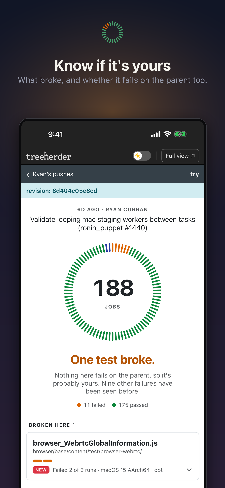
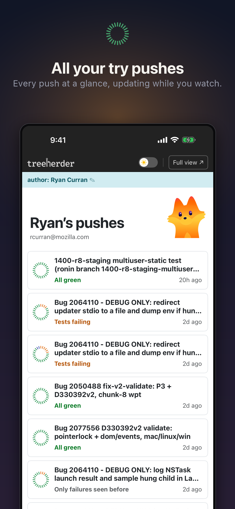
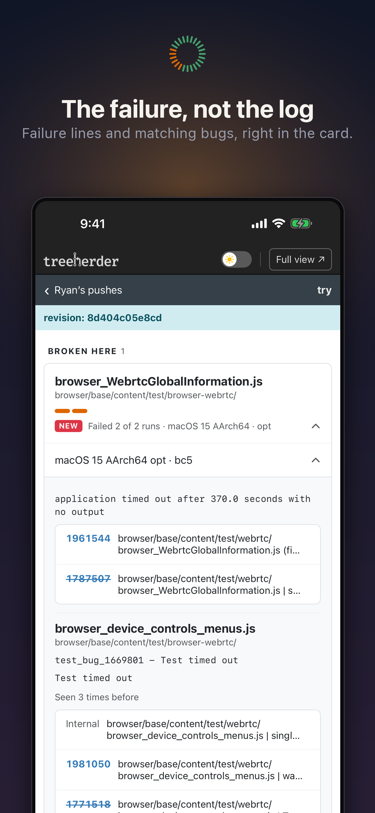
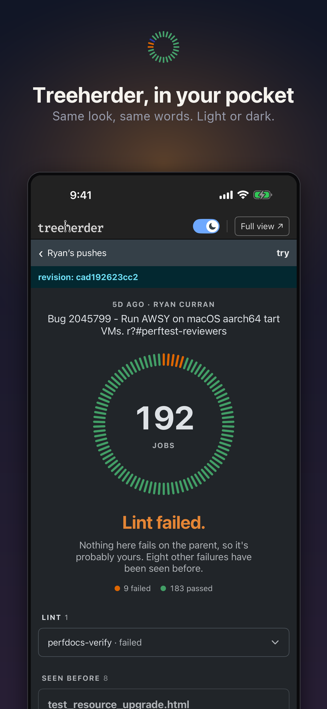

<p align="center">
  
</p>

<h1 align="center">BuildWatch</h1>

<p align="center">
  <strong>Your Firefox try pushes, on your phone.</strong><br/>
  Push to try, close the laptop, get on with your day.
</p>

<p align="center">
  <a href="https://apps.apple.com/us/app/buildwatch-moz/id6759932755">
    
  </a>
  
  
  
  
  
</p>

<p align="center">
  
  
  
  
</p>

<p align="center">
  <a href="https://apps.apple.com/us/app/buildwatch-moz/id6759932755"><strong>Download BuildWatch Moz on the App Store →</strong></a>
</p>

---

BuildWatch shows your recent try pushes, what's still running, what went red, and exactly
which tests failed, without opening Treeherder in a browser. It's for Mozilla engineers who
push to try a dozen times a day and don't want to babysit a tab.

Open a push and it tells you what happened in one sentence:

> **One test broke.**
> Nothing here fails on the parent, so it's probably yours. Nine other failures have been seen before.

Free, no account, no sign-in, no tracking. Every API it reads is public, so it works off the
corporate network with no VPN.

---

## It looks like Treeherder

Version 1.3 rebuilds the app on the design of
[Treeherder's simple view](https://github.com/mozilla/treeherder/pull/9898), the phone-sized
page that tells you one thing about your push instead of showing you everything. BuildWatch and
the simple view answer the same question for the same people, so they share one look:

- **Treeherder's own colours.** Bootstrap 5.3 with Treeherder's `#337ab7` links, the `#222`
  and `#354048` bars, the light-blue info bar, and the `--status-*` job colours from
  `treeherder-job-buttons.css`. Dark mode uses Bootstrap's dark theme, flipped with the sun and
  moon switch in the top bar.
- **The same words.** Every sentence is ported from the simple view's `strings.js`, and the
  rules behind them (the verdict, the row status, push titles, author names, how failures are
  grouped) from its `helpers.js`. Platform names come from Treeherder's `thPlatformMap`, so a
  job reads "macOS 15 AArch64" in both places.
- **The ring.** Every push is a circle of ticks, one share of the jobs each, coloured by state.
  It pops in around the circle and ripples while jobs are still running.

## What it does

### Your pushes

Your recent try pushes, newest first, each with a small ring of its jobs and one line of
status: *All green*, *Tests failing*, *Lint failing · still running*, *Running · 5 of 51*.
Kit, the Firefox mascot, keeps you company at the top.

Tap the `author: … ✎` bar to look at anyone's pushes by email. People you've looked at are
remembered on the **Pushes by…** screen.

### The verdict

Open a push for its ring, the number of jobs (or the percentage done while it runs), and the
verdict: what broke, and whether it's yours. BuildWatch reads Treeherder's Push Health to tell
a failure that's **new in your push** from one that **also fails on the parent**, one that's
been **seen before**, or a **known intermittent**, and files each failure under its heading:

**Broken here · Builds · Lint · Also failing on the parent · Seen before · Known intermittents**

Push Health only reports failures classified as new, so BuildWatch finds the rest itself from
the job list and names each one by the first failing test in its log.

### The failure, not the log

Tap a failing test and it opens in place: the failure lines from the log, whether this
failure is new in your push or how many times it's been seen before, and the Bugzilla bugs
that already match it (resolved ones struck through). From there it's one tap to the log
viewer, the raw log, or the job in Treeherder's full view.

### When it'll finish

The reason a try push is annoying is not that it fails, it's that you don't know when it
lands. While a push runs, BuildWatch estimates **when most of its results will be in**, and
shows it under the verdict: *Most by 3:40 PM · all done around 5:10 PM*.

It gives two numbers, not one, because a push doesn't finish smoothly. On a sampled 907-job
push, 90% of the jobs were done at 47 minutes and the *last* one at 144, and the tail wasn't
slow work, it was waiting: those final jobs ran for 12–25 minutes after queueing for 95–117.
So the headline is when 90% of your jobs are in, which is both the reliable number and the one
that answers "when will I know if this is green". Backtested by replaying 77 completed pushes
at nine points each:

| | median error | within ±25% | within ±50% | overruns by >30 min |
|---|---|---|---|---|
| Most results (90% of jobs) | **2 min** | **70%** | **88%** | **1%** |
| All done (last job) | 13 min | 39% | 62% | 32% |

**How.** Run time is the predictable part: a job's duration has a median coefficient of
variation of 5%, so a bundled table of per-job-type medians predicts it to within 5%. Queue
*wait* is the hard part, and it's read live from the push itself: jobs in a worker pool that
have already started tell you what the ones that haven't will wait.

**When it says nothing.** Until a pool has someone in it who has started, an estimate is
wrong by about 113 minutes, so you get progress instead of a number.

**When it's waiting on a build.** The most common reason a push looks frozen is that its tests
are `unscheduled` behind a build. Then BuildWatch says so precisely: *Tests start in ~12 min.
32 jobs wait on the macosx shippable build*. Gecko's shippable pipeline is three stages deep
(`instrumented-build-` → `generate-profile-` → `build-`), so the chain is walked rather than
just the running stage. Predicted build finishes land within 5 minutes 71% of the time.

### Watching a push

While a push is running, tap **Notify me when it finishes** (or long-press it in the list).
When its last job resolves, BuildWatch sends a notification with the pass/fail count, marked
time-sensitive if anything went red so it gets through a Focus mode. BuildWatch checks while
it's open: every 30 seconds while something is building, every two minutes once things settle.

---

## Data sources

| Source | Used for |
|--------|----------|
| [Treeherder](https://treeherder.mozilla.org) | Pushes, jobs, Push Health, failure lines and bug suggestions, log errors |
| [Bugzilla](https://bugzilla.mozilla.org) | Links to the bugs matched to a failure |
| Taskcluster | Links to raw logs, as Treeherder reports them |

All read-only, all public, all unauthenticated. **BuildWatch holds no credentials or API keys
of any kind.** It keeps four things on the device: whose pushes you're looking at, the people
you've looked at, your theme, and the pushes you're watching.

---

## Under the hood

SwiftUI throughout, state via the `@Observable` macro, networking via `async/await` on
`URLSession`. **No external dependencies and no package manager:** clone, open, run.

```
BuildWatch/
├── BuildWatchApp.swift          app entry, notification delegate
├── ContentView.swift            one navigation stack, theme, polling, in-app Safari
├── Theme/
│   └── SimpleTheme.swift        Treeherder's colours, type scale, cards, flow layout
├── Models/
│   ├── Strings.swift            the simple view's words (strings.js)
│   ├── Verdict.swift            verdict, row status, grouping (helpers.js)
│   ├── PushHealth.swift         Push Health, bug suggestions, job detail
│   ├── PlatformNames.swift      Treeherder's thPlatformMap
│   ├── Push.swift, Job.swift    pushes, jobs, results, states
│   ├── PushSummary.swift        derived job state, computed once per refresh
│   ├── PushETA.swift            completion estimate, queue-wait model, build chain
│   └── JobDurationTable.swift   bundled per-job-type run times
├── Services/
│   └── TreeHerderService.swift  Treeherder API, compact-job parser
├── ViewModels/
│   └── DashboardViewModel.swift pushes, jobs, health, people, watches
└── Views/
    ├── SimplePage.swift         bars, theme switch, page scaffold, Kit
    ├── TickRing.swift           the ring (Ring.jsx)
    ├── PushListScreen.swift     your pushes, the author bar, Pushes by…
    └── PushScreen.swift         the verdict, sections, failures in place
```

**Refreshes are deltas.** BuildWatch keeps Treeherder's own `last_modified` high-water mark
for each push and passes it back as `last_modified__gt`, so a refresh carries only the jobs
whose state moved: about **142 KB down to 1.7 KB** on a 1,262-job push. The filter works at
one-second granularity, so the client rewinds the mark two seconds and never trusts the
phone's clock.

**The compact job format.** Treeherder's `/jobs/?return_type=list` returns a
`job_property_names` header and then every job as a bare positional row, 37 columns of which
BuildWatch reads 15. `Codable` can't express that, so the parser builds a column map once per
response and indexes the rows directly, off the main thread.

**Gentle on a shared service.** Row summaries, bug suggestions and log errors are fetched
at most four at a time, background polling covers only the newest pushes plus anything watched,
and a manual pull refreshes everything on screen.

**Accessible.** Each push row reads to VoiceOver as one sentence, text scales with Dynamic
Type, and the ring, its counter and the entrance animations hold still under Reduce Motion.

`Benchmarks/ParserBenchmark.swift` runs the parser against a real Treeherder payload:

```bash
Benchmarks/fetch-fixture.sh /tmp/push.json
swiftc -O Benchmarks/ParserBenchmark.swift -o /tmp/bwbench
/tmp/bwbench /tmp/push.json
```

---

## Building

```bash
git clone https://github.com/mozilla-platform-ops/BuildWatch.git
cd BuildWatch
open BuildWatch.xcodeproj
```

Set your team under Signing & Capabilities, then run. On first launch, enter your Mozilla
email on the **Pushes by…** screen. Needs Xcode 26+ and iOS 26.2+; no Mozilla network access
or VPN.

The job-duration table behind the estimate is `BuildWatch/Resources/JobDurations.json`;
regenerate it with `tools/generate-duration-table.py`.

---

## Not implemented, on purpose

**Rerun, acknowledge and classify.** These are the obvious next features, and they're all
blocked on the same thing: Treeherder gates every write behind a Taskcluster sign-in, which
BuildWatch doesn't have. Version 1.0 shipped a retrigger button that couldn't work and failed
quietly; 1.1 removed it, and no write action will come back until sign-in is behind it.

## Releases

| Version | |
|---|---|
| **1.3** | The Treeherder simple-view design: the verdict, Push Health sections, failures and bugs in place, light and dark, anyone's pushes. And when a push will finish (built as 1.2, first shipped here) |
| **1.1** | Delta refreshes, background polling, VoiceOver, legible light mode, tier-2 completion fix, retrigger removed |
| **1.0** | First App Store release, 24 August 2026 |

## Roadmap

- [x] Notifications when a watched push finishes
- [x] Estimated time to completion
- [x] The Treeherder simple-view design
- [ ] Taskcluster sign-in, the prerequisite for every write action below
- [ ] Rerun failed jobs
- [ ] Acknowledge and classify failures
- [ ] File a bug pre-filled with failure details
- [ ] Live updates from Treeherder's Pulse stream

---

## Contributing

PRs welcome. Bugs and ideas:
[GitHub issues](https://github.com/mozilla-platform-ops/BuildWatch/issues/new), which is also
where the link at the bottom of every screen in the app goes.

---

<p align="center">
  <a href="https://apps.apple.com/us/app/buildwatch-moz/id6759932755">BuildWatch Moz on the App Store</a>
  &nbsp;·&nbsp;
  Built by <a href="https://github.com/rcurranmoz">@rcurranmoz</a>
  &nbsp;·&nbsp;
  <a href="https://github.com/mozilla-platform-ops/BuildWatch">mozilla-platform-ops/BuildWatch</a>
  &nbsp;·&nbsp;
  Powered by <a href="https://treeherder.mozilla.org">Treeherder</a>
</p>
